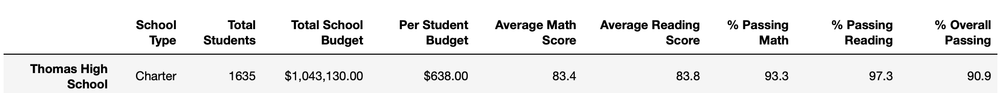
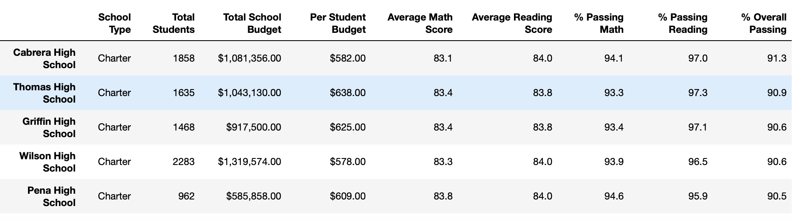
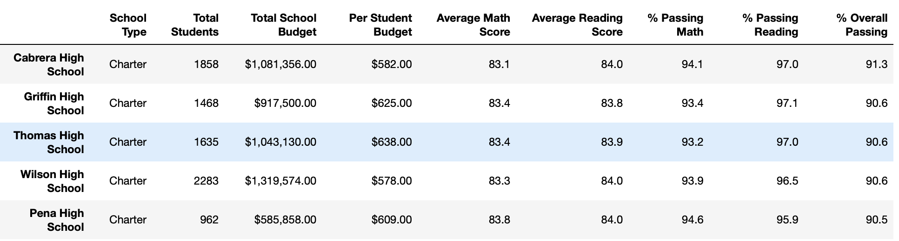

# School_District_Analysis
Anallyzing testing data across the district. Utilizing Jupyter Notebook, Python 3.7.6. 
## Analysis Overview ##
The chief aim of this project is the analyze the testing results for the given school district, for both district and charter schools. The key analyses were calculating the passing rates for the math and reading portions of the test, the averages for the math and reading scores, and an overalll passing rate determined by the number of students passing both math and reading. In addition to breaking down the results by school and by grade, the analysis took into consideration several factors for comparison, listed below. 
- School type: District vs. Charter
- School size: Small (<1000), Medium (1000-2000), and Large (2000-5000)
- School per Capita spending

The scope of this analysis to provide useful snapshots of data to both district leaders and specific school personnel. 
## Results ##
Initial results are displayed below. Due to a compromise of testing security, follow analyses were performed to adjust the original results. Initial analyses were adjusted by removing the 9th grade reading and math scores from Thomas High School (THS). The effects are specified below. 
- Initial District Summary:  

- Adjusted District Summary:  
  
On a district wide level (with 39170 students total), the effects of removing the 461 9th grade scores from THS are minimal. The greatest change being that the adjusted percent of students passing reading rose by .3%. With the exception of the average reading score which had no significant change, the other values showed an increase by about .1%.  
- Initial School Summary:  

- Adjusted School Summary:  
  
While average math score showed no significant change and average reading score even improved by 0.1%, removing the compromised scores dropped the % passing rates by tenths of percentage points in all 3 categories. 
- These drops hurt the school's overall standing relatively speaking, causing it to drop from the 2nd ranked school by % Overall Passing, to the 3rd ranked school behind Griffin. 
 
- **Changes on Scores by Grade Level**: Given that each average for was calculated indpendently for each grade level, substituting *NaN* values for the 9th grades at THS has no impact on any of the scores, save for the dropping of an average for 9th graders. Displayed are the scores by grade levels, and the adjustment made for THS. 

  
  
   
  

